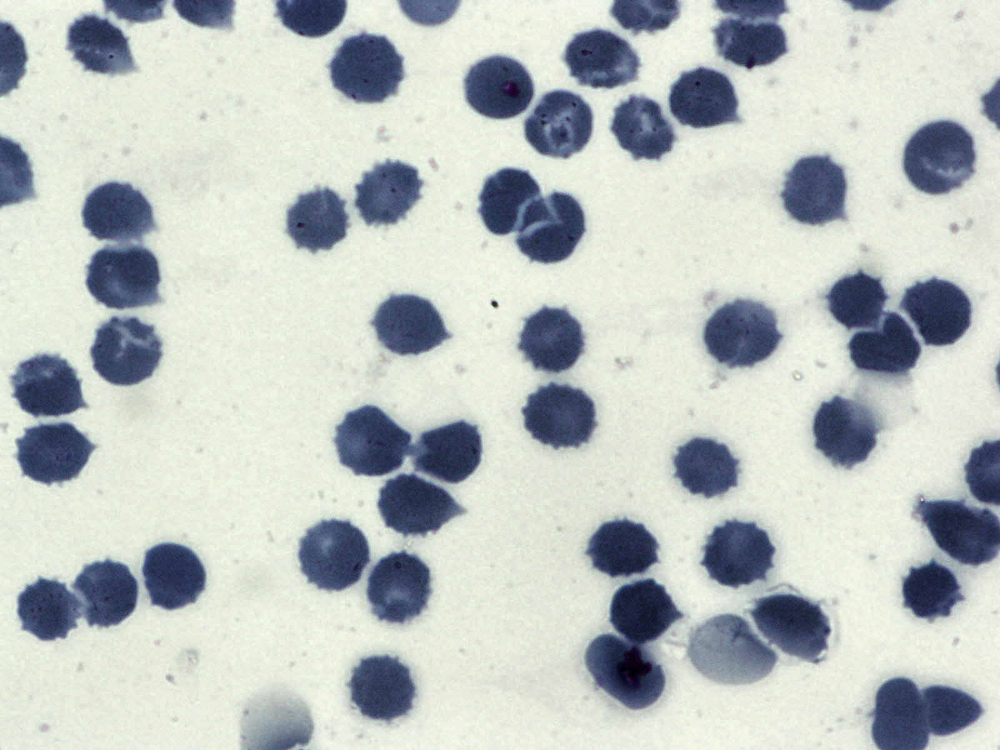

# Segmentation Image

Segmentation Image is a full-stack web application for creating image annotation projects, managing labels and collaborators, and saving canvas-based segmentation work. The app combines a React/Vite frontend with an Express/MongoDB backend and real-time notifications over Socket.IO.

**Live Demo:** [cellseg.nqb37.live](https://cellseg.nqb37.live)

## Features

- User signup, login, profile updates, avatar changes, and password changes.
- Project boards for uploaded source images.
- Canvas annotation tools with brush, eraser, zoom, pan, and visibility controls.
- MediaPipe hand gesture control for canvas drawing (Victory pose), panning, and zooming (pinch up/down).
- Client-side nuclei segmentation using TensorFlow.js (U-Net model).
- Label management for annotation colors.
- Owner/member board permissions.
- Member invitations with persistent and real-time notifications.
- Annotation and segmentation image fields stored with each board.
- TensorFlow.js model assets included under `frontend/public/unet/`.

## Sample Nuclei Segmentation

|                       Original Image                       |                      Segmentation Mask                       |
| :--------------------------------------------------------: | :----------------------------------------------------------: |
|  |  |

## Tech Stack

| Layer    | Technologies                                                                                                      |
| -------- | ----------------------------------------------------------------------------------------------------------------- |
| Frontend | React, Vite, React Router, Zustand, Tailwind CSS, Radix UI, Fabric.js, TensorFlow.js, MediaPipe, Socket.IO Client |
| Backend  | Node.js, Express, Mongoose, MongoDB, JWT, Socket.IO                                                               |
| Testing  | Jest, Supertest, in-memory model helpers for backend service/controller tests                                     |

## Repository Structure

```text
segmentation-image/
|-- backend/                     # Express API, services, models, routes, tests
|   |-- config/
|   |-- controllers/
|   |-- middleware/
|   |-- models/
|   |-- routes/
|   |-- services/
|   |-- tests/
|   |-- utils/
|   |-- app.js
|   `-- server.js
|-- frontend/                    # React + Vite client
|   |-- public/
|   |   `-- unet/                # TensorFlow.js model files
|   |-- src/
|   |   |-- api/
|   |   |-- components/
|   |   |-- hooks/
|   |   |-- lib/
|   |   |-- pages/
|   |   `-- stores/
|   `-- vite.config.js
`-- docs/                        # Review notes, implementation plans, and specs
```

## Prerequisites

- Node.js 20 or newer.
- npm 10 or newer.
- MongoDB running locally or available through a connection URI.

## Environment Variables

Create environment files from the examples before running the apps.

### Backend

Create `backend/.env`:

```env
MONGO_URI=mongodb://localhost:27017/segmentation_db
DATABASE_NAME=segmentation_db
PORT=3700
SECRET=replace_with_a_strong_jwt_secret
```

The backend reads `PORT` at startup. Make sure this port matches the frontend `VITE_API_URL`.

### Frontend

Create `frontend/.env`:

```env
VITE_API_URL=http://localhost:3700
```

## Installation

Install dependencies separately for the backend and frontend:

```bash
cd backend
npm install

cd ../frontend
npm install
```

## Running Locally

Start the API:

```bash
cd backend
npm run dev
```

Start the frontend in a second terminal:

```bash
cd frontend
npm run dev
```

Open the Vite URL printed by the frontend command, usually `http://localhost:5173`.

## Available Scripts

### Backend

| Command              | Description                      |
| -------------------- | -------------------------------- |
| `npm run dev`        | Start the API with Nodemon.      |
| `npm start`          | Start the API with Node.         |
| `npm test`           | Run the Jest backend test suite. |
| `npm run test:watch` | Run backend tests in watch mode. |
| `npm run lint`       | Run ESLint for backend files.    |

### Frontend

| Command           | Description                           |
| ----------------- | ------------------------------------- |
| `npm run dev`     | Start the Vite development server.    |
| `npm run build`   | Build the frontend for production.    |
| `npm run preview` | Preview the production build locally. |
| `npm run lint`    | Run ESLint for frontend files.        |

## API Overview

The backend mounts routes under these base paths:

| Base Path                | Purpose                                                                          |
| ------------------------ | -------------------------------------------------------------------------------- |
| `/api/userRoute`         | Authentication and profile management.                                           |
| `/api/boardRoute`        | Board CRUD, annotation updates, labels, members, and board leave/delete actions. |
| `/api/inviteRoute`       | Board invitation listing, creation, acceptance, and cancellation.                |
| `/api/notificationRoute` | Notification listing, unread counts, read status, and deletion.                  |

Most routes require a bearer token:

```http
Authorization: Bearer <jwt>
```

Socket.IO connections also authenticate with the same token through the socket auth payload.

## Verification

Run the checks that match the part of the app you changed:

```bash
cd backend
npm test
npm run lint

cd ../frontend
npm run lint
npm run build
```

For manual verification, run both apps and exercise the affected workflow, such as signup/login, creating a board, opening the annotation workspace, saving annotations, inviting a member, responding to an invite, and checking real-time notifications.

## Current Notes

- The app stores uploaded images and annotation images as base64 strings in MongoDB documents. This is simple for development, but large files can approach MongoDB document-size limits.
- TensorFlow.js model files are present in `frontend/public/unet/`, but the segmentation inference flow should be verified before treating it as production-ready.
- There is no root-level script that starts both applications. Run `backend` and `frontend` commands in separate terminals.

## Contributing

- Keep backend changes scoped to the relevant route, controller, service, model, or middleware.
- Keep frontend components, hooks, stores, and pages aligned with the existing folder structure.
- Run backend tests for API or permission changes.
- Run frontend lint/build checks for UI changes.
- Do not commit generated dependency directories such as `node_modules/` or build output such as `dist/`.
